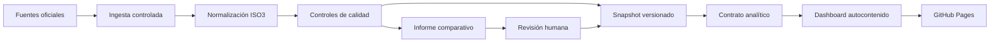

# Arquitectura pública del Observatorio

## Producto

El Observatorio Global de IA en Educación y Empresa es una aplicación web estática, reproducible y de solo lectura. La publicación no necesita servidor de aplicación ni base de datos en producción: GitHub Pages entrega un paquete autocontenido generado desde fuentes públicas.

## Flujo de información

## Capas

| Capa | Artefacto | Responsabilidad |
|---|---|---|
| Fuentes | `config/sources.json` | Registro, estado y reglas de procedencia |
| Ingesta | `src/import-*.mjs`, `src/refresh.mjs` | Descarga y lectura reproducible |
| Datos | `data/processed/snapshot.json` | Contrato normalizado por país, año, métrica y fuente |
| Analítica | `dashboard/artifact.json` | Tablas, indicadores y metadatos de visualización |
| Presentación | `dashboard/index.html` | Aplicación interactiva autocontenida |
| Publicación | `_site/` | HTML, CSV, JSON, estado, políticas y activos públicos |
| Gobierno | `reports/update-candidate.md` | Comparación y controles de cada actualización |

## Ciclo de publicación

1. Una ejecución mensual recupera las fuentes activas.
2. Las pruebas verifican rangos, duplicados, cobertura y salud de fuentes.
3. El sistema genera un informe de variaciones frente a la versión publicada.
4. Los cambios se presentan en un pull request, sin modificar directamente `main`.
5. La integración aprobada activa la construcción y publicación en GitHub Pages.
6. El sitio expone el estado, los datos descargables y la identificación de la versión.

## Controles mínimos

- 215 países y economías como cobertura mínima del catálogo.
- 35 países con medición directa de uso o adopción de IA.
- 160 países con AIPI y 190 con Oxford Government AI Readiness.
- Todas las fuentes activas deben finalizar en estado saludable.
- Una actualización no puede perder más del 10 % de las observaciones frente a la línea base.
- Dependencias de ejecución fijadas y acciones de GitHub referenciadas por identificador inmutable.

## Autoridad y responsabilidad

César David Rincón Godoy conserva la dirección intelectual, metodológica y editorial. OpenAI Codex participa como asistencia técnica declarada. La automatización prepara evidencia y propuestas; no sustituye la revisión ni la aprobación humana.
