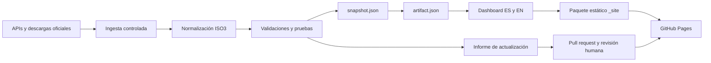

# Bitácora técnica integral y cierre del proyecto v0.4.0

## Control del documento

| Campo | Valor |
|---|---|
| Proyecto | Observatorio Global de Inteligencia Artificial en Educación y Empresa |
| Identificador | OIAEE-BIT-004 |
| Versión documentada | 0.4.0 |
| Fecha de cierre técnico | 1 de agosto de 2026 |
| Responsable intelectual y editorial | César David Rincón Godoy |
| ORCID | https://orcid.org/0009-0003-2112-3851 |
| Repositorio | https://github.com/rinconcd67/observatorio-ia-educacion-empresa |
| Sitio público ES | https://rinconcd67.github.io/observatorio-ia-educacion-empresa/ |
| Sitio público EN | https://rinconcd67.github.io/observatorio-ia-educacion-empresa/en/ |
| Estado | Cierre técnico documentado; operación continua activa |
| Clasificación | Documento interno de control del proyecto, conservado en repositorio público |

## 1. Resumen ejecutivo

El proyecto se inició y alcanzó su primera edición pública completa el 1 de agosto de 2026. El resultado es una aplicación web estática, bilingüe, reproducible y de solo lectura para consultar preparación, adopción, uso y condiciones de contexto de la inteligencia artificial por país y región en los sectores educativo, empresarial y gubernamental.

La versión 0.4.0 mantiene 5.280 observaciones normalizadas, un catálogo de 218 países y economías, siete regiones, 11 fuentes operativas, 40 países con mediciones directas de uso o adopción, 165 países con índice AIPI y 194 países conciliados con Oxford Government AI Readiness 2025. La aplicación publica rutas equivalentes en español e inglés desde un único contrato analítico.

El cierre no termina el observatorio. Cierra la construcción y publicación de la línea base v0.4.0 y transfiere el sistema a un régimen de monitoreo continuo, actualización gobernada y revisión humana.

## 2. Propósito y alcance

El observatorio fue concebido para:

- comparar la adopción y el uso de IA entre países y regiones;
- diferenciar uso real, capacidad de adopción, preparación estructural y gobernanza;
- evitar la combinación metodológicamente incorrecta de índices con escalas distintas;
- preservar la ausencia de datos como ausencia, sin imputarla como cero;
- ofrecer evidencia descargable y trazable para investigación académica y análisis institucional;
- sostener actualizaciones periódicas sin publicar cambios automáticamente fuera de revisión humana.

El alcance funcional de v0.4.0 incluye ocho vistas: Global, Regiones, Países, Educación, Empresa, Gobernanza, Fuentes y Acerca. Incluye mapa mundial, filtros, comparadores territoriales, tablas de detalle, visualizaciones de brechas, salud de fuentes y descargas de datos procesados.

## 3. Autoría, colaboración y propiedad intelectual

La concepción, dirección intelectual, selección de fuentes, decisiones metodológicas, interpretación y aprobación final corresponden a César David Rincón Godoy.

OpenAI Codex fue utilizado como herramienta de asistencia tecnológica para arquitectura, ingeniería de datos, programación, visualización, automatización, documentación, pruebas y control de calidad. Esta asistencia no sustituye la responsabilidad humana ni constituye autoría académica.

El código, la metodología, la estructura analítica, los textos y el diseño original están protegidos por los archivos `LICENSE-CODE.md` y `LICENSE-CONTENT.md`. La publicación del repositorio permite transparencia y consulta, pero no convierte el código en software de código abierto ni transfiere derechos. Los datos de terceros conservan sus licencias y condiciones de uso.

## 4. Cronología técnica

### 4.1 Construcción directa inicial

| Hora EDT | Commit | Hito |
|---|---|---|
| 10:35 | `90e5ed2` | Construcción del observatorio inicial, conectores públicos, normalización y primer dashboard. |
| 11:02 | `bbfc9b7` | Ampliación de cobertura global mediante OCDE e IMF AIPI. |
| 11:43 | `a99f509` | Reconstrucción visual y analítica v0.3 con mapa, regiones y Oxford Insights. |

### 4.2 Preparación pública y correcciones

| Hora EDT | Commit | PR | Hito |
|---|---|---:|---|
| 12:36 | `f1fb2ee` | #1 | Preparación de publicación pública v0.3.1, autoría, gobernanza y GitHub Pages. |
| 12:40 | `4de68ec` | #1 | Fusión de la publicación pública v0.3.1. |
| 12:44 | `838c194` | #8 | Corrección del desbordamiento de filtros en dispositivos móviles. |
| 12:44 | `fd844a8` | #8 | Fusión de la corrección móvil. |
| 12:48 | `04bef6f` | #9 | Incorporación de metadatos y mejoras de accesibilidad. |
| 12:49 | `abc62e7` | #9 | Fusión de metadatos y accesibilidad. |
| 12:51 | `3f93bea` | #10 | Conservación de actualizaciones cuando GitHub restringe la creación automática del PR. |
| 12:52 | `0c407e2` | #10 | Fusión del control de actualización restringida; etiqueta `v0.3.1`. |

### 4.3 Edición bilingüe v0.4.0

| Hora EDT | Commit | PR | Hito |
|---|---|---:|---|
| 13:34 | `5ffac55` | #11 | Implementación integral de la edición bilingüe. |
| 13:36 | `9d89a65` | #11 | Fusión y base de la etiqueta `v0.4.0`. |
| 13:40 | `ab4e1df` | #12 | Actualización de la memoria del proyecto. |
| 13:40 | `0704af7` | #12 | Fusión del cierre documental de v0.4.0. |

### 4.4 Google Search Console e indexación

| Hora EDT | Commit | PR | Hito |
|---|---|---:|---|
| 14:01 | `e465889` | #13 | Incorporación de la etiqueta de verificación de Google Search Console y su validación automática. |
| 14:02 | `6dc04a7` | #13 | Fusión y despliegue de la verificación. |
| 14:09 | `614ff22` | #14 | Registro de propiedad verificada, sitemap enviado e indexación solicitada. |
| 14:10 | `9077220` | #14 | Fusión del cierre operativo de Search Console. |

Todas las solicitudes de cambio utilizadas para la publicación pasaron las validaciones configuradas antes de su fusión. La versión pública v0.4.0 fue publicada además como release formal de GitHub el 1 de agosto de 2026 a las 17:37:50 UTC.

## 5. Arquitectura del sistema



### 5.1 Capas y responsabilidades

| Capa | Componentes principales | Responsabilidad |
|---|---|---|
| Configuración | `config/active_sources.json`, `config/controlled_downloads.json` | Registro de fuentes, acceso, obligatoriedad y frecuencia. |
| Ingesta | `src/refresh.mjs`, `src/import-aipi.mjs`, `src/import-oxford-readiness.mjs` | Recuperación de APIs y descargas controladas. |
| Procesamiento | `src/lib/`, `src/build-artifact.mjs` | Parsing, homologación ISO3, precedencia y construcción de métricas. |
| Datos normalizados | `data/processed/snapshot.json` | Contrato fuente de países, observaciones y ejecuciones. |
| Contrato analítico | `dashboard/artifact.json` | Datasets, metadatos, geometría y estructura de visualización. |
| Presentación | `src/dashboard/`, `dashboard/index.html`, `dashboard/en/index.html` | Aplicación autocontenida, accesible y localizada. |
| Publicación | `src/package-site.mjs`, `_site/`, GitHub Pages | Empaquetado y entrega pública estática. |
| Control | `test/`, `src/validate-data.mjs`, `.github/workflows/` | Pruebas, validación, CI, actualización y despliegue. |

### 5.2 Características de implementación

- Runtime: Node.js 20 o posterior; GitHub Actions ejecuta Node.js 22.
- Módulos: ECMAScript Modules.
- Dependencia de producción fijada: `read-excel-file` 9.3.4.
- Aplicación pública: HTML, CSS, JavaScript, datos y GeoJSON autocontenidos.
- Producción: sin servidor de aplicación, base de datos, credenciales de usuario ni procesamiento de datos personales.
- Publicación: GitHub Pages con HTTPS y paquete generado en `_site/`.
- Acciones de GitHub: referenciadas mediante identificadores inmutables.
- Archivos crudos: excluidos de Git; solo se conserva `data/raw/.gitkeep`.
- Paquete `_site/`: generado y excluido de Git para evitar duplicación de artefactos.

## 6. Fuentes y cobertura

### 6.1 Fuentes operativas de la línea base

| Grupo | Fuente | Conector | Estado |
|---|---|---|---|
| Empresa | Eurostat `isoc_eb_ai` | API pública sin llave | Operativo |
| Educación formal | Eurostat `isoc_ai_iaiu` | API pública sin llave | Operativo |
| Estudiantes | Eurostat `isoc_ai_iaiu` | API pública sin llave | Operativo |
| Empresa | OCDE ICT Businesses | API SDMX pública sin llave | Operativo |
| Individuos | OCDE Individual GenAI | API SDMX pública sin llave | Operativo |
| Catálogo país | Banco Mundial | API pública sin llave | Operativo |
| Conectividad | Banco Mundial | API pública sin llave | Operativo |
| Educación terciaria | Banco Mundial | API pública sin llave | Operativo |
| Contexto económico | Banco Mundial | API pública sin llave | Operativo |
| Preparación | IMF AI Preparedness Index 2023 | Descarga XLSX controlada | Operativo |
| Gobernanza | Oxford Government AI Readiness 2025 | JSON incrustado en página oficial | Operativo |

### 6.2 Estado cuantitativo certificado

| Indicador | Valor |
|---|---:|
| Países y economías del catálogo | 218 |
| Regiones | 7 |
| Observaciones normalizadas | 5.280 |
| Fuentes activas y saludables | 11 de 11 |
| Países con medición directa de IA | 40 |
| Cobertura directa del catálogo | 18,3 % |
| Países con AIPI 2023 | 165 |
| Cobertura AIPI | 75,7 % |
| Países con Oxford 2025 conciliado | 194 |
| Cobertura Oxford | 89,0 % |
| Países con cruce de medición directa | 33 |

La ejecución que generó la línea base terminó el 1 de agosto de 2026 a las 16:23:03 UTC. Los 11 registros de ejecución figuran en estado `ok` y conservan huellas SHA-256 de las respuestas originales. Oxford publicó 195 registros; 194 se conciliaron con el catálogo y Taiwán quedó registrado como caso no conciliado, no oculto.

## 7. Reglas metodológicas y de calidad

- La unidad territorial se normaliza mediante ISO3.
- Eurostat prevalece sobre OCDE cuando ambas fuentes ofrecen el mismo indicador empresarial para un país y periodo coincidentes.
- AIPI se conserva en escala de 0 a 1 y Oxford en escala de 0 a 100.
- Los índices AIPI y Oxford no se suman ni se convierten en un indicador sintético nuevo.
- Los promedios son simples y no ponderados, salvo indicación expresa de la fuente.
- Los periodos pueden variar entre indicadores y siempre se muestran en la interfaz.
- Los datos ausentes se mantienen como `null` o sin dato; nunca se sustituyen por cero.
- Las métricas educativas, empresariales e individuales representan poblaciones distintas y no permiten inferencia causal directa.
- Cada ejecución conserva fuente, periodo, unidad, procedencia, estado y checksum.

Los umbrales de regresión exigen un mínimo de 215 países en el catálogo, 35 países con medición directa, 160 con AIPI, 190 con Oxford, todas las fuentes activas saludables y no perder más del 10 % de las observaciones frente a la línea base.

## 8. Producto público v0.4.0

La publicación expone:

- ruta española canónica en `/`;
- ruta inglesa canónica en `/en/`;
- selector ES/EN que conserva vista, país e indicador;
- metadatos canónicos, `hreflang`, Open Graph y datos estructurados Schema.org;
- manifiestos web e imágenes sociales diferenciados por idioma;
- `robots.txt` con rastreo permitido;
- `sitemap.xml` con las dos rutas y alternancias lingüísticas;
- archivos CSV y JSON descargables;
- autoría, cita, política de datos, privacidad y declaración de colaboración humano-IA.

## 9. Automatización y gobierno de cambios

### 9.1 Integridad continua

El workflow `Integridad del observatorio` se ejecuta en cada `push` y pull request. Instala dependencias con `npm ci`, construye el sitio, ejecuta pruebas, valida datos, audita dependencias de producción y comprueba el formato del diff.

### 9.2 Publicación

El workflow `Publicar observatorio` se activa únicamente desde `main` o por ejecución manual. Construye y valida el paquete, configura GitHub Pages, sube `_site/` y publica mediante permisos mínimos de Pages e identidad OIDC.

### 9.3 Actualización mensual

El workflow `Proponer actualización de datos` se programa para el primer día de cada mes a las 10:15 UTC. Conserva la línea base, actualiza fuentes, valida, genera un informe comparativo y crea una rama y un pull request. Si la política de GitHub impide abrir el PR, conserva la rama y publica el vínculo de revisión manual. Ningún dato nuevo se integra en `main` sin revisión humana.

## 10. Seguridad, privacidad y reproducibilidad

- El sitio es de solo lectura y no recibe credenciales, pagos ni datos personales de visitantes.
- No se almacenan secretos ni llaves de API en el repositorio.
- Las fuentes se consultan durante procesos controlados, no desde el navegador del visitante.
- Los permisos de cada workflow se limitan a su función.
- Las dependencias se instalan desde `package-lock.json`.
- La construcción se reproduce con `npm ci`, `npm run build` y `npm run check`.
- Los archivos públicos pueden compararse con sus canónicos locales mediante SHA-256.
- Correcciones y cambios metodológicos deben documentarse en `CHANGELOG.md` y, cuando corresponda, producir una nueva versión.

## 11. Evidencia de publicación

La verificación realizada el 1 de agosto de 2026, aproximadamente a las 18:28 UTC, confirmó:

- repositorio GitHub con visibilidad `PUBLIC` y rama predeterminada `main`;
- release `v0.4.0` publicada y no marcada como borrador ni prerelease;
- ruta española con HTTP 200 y `text/html; charset=utf-8`;
- ruta inglesa con HTTP 200 y `text/html; charset=utf-8`;
- sitemap con HTTP 200 y `application/xml`;
- `robots.txt` con HTTP 200 y rastreo permitido;
- coincidencia exacta de las huellas SHA-256 entre los cuatro archivos públicos y sus canónicos locales;
- ejecución de integridad `30711938287` finalizada con `success`;
- despliegue de Pages `30711938228` finalizado con `success`;
- propiedad verificada en Google Search Console;
- sitemap enviado y solicitudes de indexación aceptadas para ambas rutas.

El detalle formal se conserva en `docs/CERTIFICACION_PUBLICACION_V0.4.0.md` y la evidencia estructurada en `docs/evidence/publication-v0.4.0.json`.

## 12. Riesgos, límites y asuntos pendientes

| Asunto | Estado al cierre | Tratamiento |
|---|---|---|
| Indexación efectiva en Google | Pendiente de procesamiento externo | Supervisar Search Console; no reenviar repetidamente. |
| Primera lectura del sitemap en Search Console | Mostró inicialmente «No se ha podido obtener» | La URL pública respondió HTTP 200 con XML válido; supervisar su reprocesamiento. |
| Dependabot | Existen propuestas de actualización | Revisar cada PR, compatibilidad y resultado de CI antes de fusionar. |
| Runtime interno de algunas GitHub Actions | GitHub informó de transición forzada de Node.js 20 a 24 | Actualizar las acciones de forma controlada después de evaluar sus versiones. |
| UNESCO UIS y TALIS 2024 | No integrados en la línea base v0.4.0 | Incorporar con reglas de procedencia y validación en una versión posterior. |
| Cobertura directa global | 18,3 % del catálogo | No confundir catálogo mundial con disponibilidad mundial de uso directo. |
| Taiwán en Oxford 2025 | No conciliado con el catálogo actual | Mantener visible en registros y resolver mediante decisión territorial documentada. |

## 13. Procedimiento operativo posterior al cierre

1. Revisar mensualmente el resultado del workflow de actualización.
2. Evaluar el informe de variaciones y la salud de las 11 fuentes.
3. Rechazar cualquier actualización con pérdida material de cobertura o cambios de esquema no explicados.
4. Ejecutar `npm run build` y `npm run check` antes de aprobar un PR.
5. Comprobar la paridad funcional ES/EN después de cambios de interfaz o datos.
6. Confirmar el despliegue de Pages y las respuestas HTTP públicas después de cada fusión.
7. Registrar cambios metodológicos en `CHANGELOG.md` y emitir una nueva versión cuando cambie el contrato analítico.
8. Verificar periódicamente Search Console, sitemap, Core Web Vitals y seguridad de dependencias.

## 14. Comandos de recuperación y verificación

```bash
npm ci
npm run build
npm run check
npm run serve
git status --short --branch
```

Para una actualización completa controlada:

```bash
npm run refresh
npm run check
npm run report:update
```

## 15. Declaración de cierre

Se declara cerrada la fase de construcción y publicación de la versión 0.4.0. El código, los datos procesados, la documentación, las pruebas, la automatización, la release y el sitio público conforman una línea base reproducible y auditable.

El repositorio queda sujeto a operación continua. Cualquier cambio posterior debe realizarse en una rama, pasar validaciones, ser revisado mediante pull request y quedar integrado en `main` con historial limpio y trazable.

**Responsable:** César David Rincón Godoy

**Fecha:** 1 de agosto de 2026

**Lugar institucional:** Broward International University, Miami, Florida, Estados Unidos
